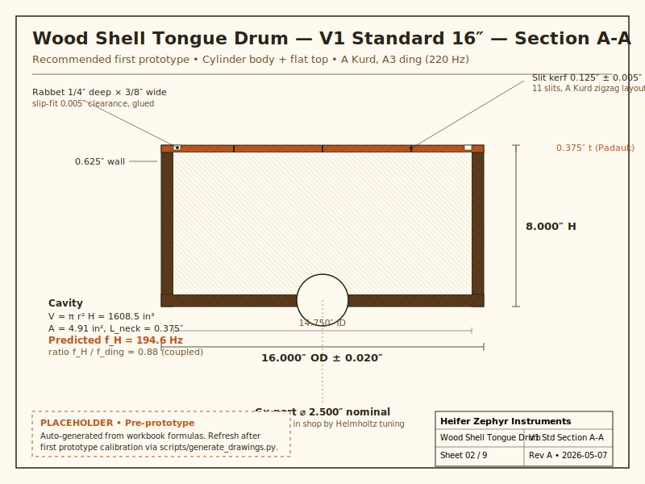

# Wood Shell Tongue Drum

Slit-tongue idiophone with an enclosed wooden resonator. A round-body counterpart to the rectangular-prism wood tongue drum, with **Helmholtz cavity coupling** absent from open designs. Four geometric variants × three size envelopes, all parametric and traceable to a single design table.

Part of the [tonykoop/instrument-maker](https://github.com/tonykoop/instrument-maker) catalogue.

*V1 Cylinder + Flat Top, Standard 16″ — recommended first prototype. Black Walnut staves, Padauk soundboard, A Kurd 11-tongue field, gu port for Helmholtz tuning. Computed `f_H = 194.6 Hz` sits at 0.88 × the A3 ding (220 Hz) — inside the coupled regime by design.*

**Current V5 status:** prototype/planning packet with a V5 explorer surface. The design table, packet docs, print packet, and hero SVG are useful for review, but the repo is not build-ready or measured. Tongue tuning, Helmholtz coupling, Padauk material constants, shell response, CAD, DXF, and G-code all remain measurement- or calibration-gated. See [`v5-readiness.md`](v5-readiness.md), [`validation-loop.csv`](validation-loop.csv), [`visual-output-register.csv`](visual-output-register.csv), and [`explorer.html`](explorer.html).

## What's new in this design

A round-body wood tongue drum with an enclosed cavity is not a commercial category at this depth. Three things distinguish it:

1. **Round body, not rectangular.** Tony's existing rectangular-prism wood tongue drum is the precursor; this design moves the same flat-cantilever physics onto a turned cylinder or hemisphere bowl.
2. **Enclosed Helmholtz cavity.** Open rectangular tongue drums waste cavity volume out the open ends. Closing the bowl puts a Helmholtz resonator under the tongue field — bass extension below the lowest tongue, tunable in the shop via the gu port.
3. **Premium tonewoods, manufacturable scope.** Padauk soundboard for the A4 reference; Black Walnut shell for the bowl. Four variants × three sizes laid out as a coordinated portfolio family rather than four bespoke pieces.

## The matrix

Four geometric variants × three size envelopes = twelve cells. Each cell carries its own chamber volume, Helmholtz frequency, tongue-fit verdict, and risk grade.

| Variant | Body                          | Top                  | Risk    | Notes                                              |
|---------|-------------------------------|----------------------|---------|----------------------------------------------------|
| V1      | Cylinder (ottoman silhouette) | Flat soundboard      | ★★      | Lowest piece-count, most predictable tuning. **Start here.** |
| V2      | Cylinder                      | Shallow CNC-domed    | ★★★     | Steel-tongue-drum aesthetic on a wooden body       |
| V3      | Hemisphere bowl               | Flat soundboard      | ★★      | Tagine / Moroccan-pouf silhouette                  |
| V4      | Hemisphere bowl               | Domed top            | ★★★★    | Most steel-tongue-drum-adjacent silhouette in wood |

**Sizes:** Travel 12″ Ø · Standard 16″ Ø (Moroccan-ottoman scale) · Floor Pouf 20″ Ø.

The full Helmholtz/ding ratio matrix is in [`design.md`](design.md) §2.4. Three cells sit cleanly in the coupled regime (V1 Standard, V1 Floor Pouf, V3 Standard); V2 cells need a larger-than-preset gu port or a lower cavity/neck correction to reach coupling; V1 Travel sits right at the upper edge of the band.

## Recommended first prototype

**V1 Cylinder + Flat Top, Standard 16″, A Kurd, A3 ding (220 Hz), 11 tongues.** Justification:

- Acoustic predictability — flat-cantilever physics has < 1 % empirical detuning on Tony's prior rectangular drums.
- Helmholtz coupled out-of-the-box at `f_H/f_ding = 0.88`.
- All 11 A Kurd tongues fit within the 7″ radial cap with 8 % margin.
- Lowest piece-count: 16 staves + 1 disc = 17 wood pieces.
- Dual body-construction paths (stave or segmented) — pick the aesthetic, the physics is the same.
- Validated workflow components — stave glue-up, lathe truing, CNC slit routing — exercised on Tony's existing ashiko, conga, and tongue-drum repos.

Detailed prototype spec (dimensions, tongue length schedule, joint tolerances) in [`design.md`](design.md) §4.

## Acoustic model in one paragraph

The wood shell tongue drum is a 2-DOF coupled oscillator: the cantilever tongue is one resonator, the enclosed air cavity is another, and they share a common boundary (the soundboard). Tongues follow flat-cantilever Euler-Bernoulli `f = K · t / L²`, with `K ≈ 24,438` for Padauk. Domed tongues add a +2.5 % length correction (a starting estimate to be calibrated empirically on the first V2 build). The cavity follows the Helmholtz formula `f_H = (c/2π) · √(A_port / (V · L_neck))`; the gu port is the primary tuning knob — drilled last and step-bored in the shop while measuring `f_H`. Target: `f_H/f_ding ∈ [0.80, 1.20]`. See [`design.md`](design.md) §2 for the full derivation.

## Repo contents

| File / folder                                  | Purpose                                                   |
|------------------------------------------------|-----------------------------------------------------------|
| [`design.md`](design.md)                       | Governing model, variant blocks, recommended prototype    |
| [`wood-shell-tongue-drum-design-table.xlsx`](wood-shell-tongue-drum-design-table.xlsx) | Parametric workbook (190 formulas, 1 sheet)               |
| [`family-spec.csv`](family-spec.csv)           | Twelve family rows spanning V1-V4 across Travel / Standard / Floor Pouf |
| [`v5-readiness.md`](v5-readiness.md) / [`validation-loop.csv`](validation-loop.csv) | V5 explorer readiness gates and empirical validation loop |
| [`visual-output-register.csv`](visual-output-register.csv) / [`explorer.html`](explorer.html) | Visual authority register and root explorer dashboard |
| [`bom.csv`](bom.csv) / [`sourcing.csv`](sourcing.csv) / [`cut-list.csv`](cut-list.csv) / [`validation.csv`](validation.csv) | Manufacturing CSVs                                        |
| [`assembly-manual.md`](assembly-manual.md)     | 7-phase build instructions                                |
| [`supplier-rfq.md`](supplier-rfq.md)           | Q2 2026 batch supplier RFQ                                |
| [`drawing-brief.md`](drawing-brief.md) / [`drawings/`](drawings/) | 9-sheet drawing spec + hero SVG                           |
| [`visual-bom-brief.md`](visual-bom-brief.md) / [`photo-shotlist.md`](photo-shotlist.md) | Photography briefs                                        |
| [`risks.md`](risks.md)                         | Red-team pass with verification tests attached            |
| [`joinery-configuration-matrix.md`](joinery-configuration-matrix.md) | Practical shell and soundboard joinery comparison for issue `instrument-maker#118` |
| [`resources.md`](resources.md) / [`jig-decision.md`](jig-decision.md) | Public-safe provenance, references, and fixture decisions |
| [`wolfram-starter.wl`](wolfram-starter.wl)     | 3-DOF coupled-oscillator notebook starter                 |
| [`wolfram/`](wolfram/) / [`jigs/`](jigs/) / [`data/`](data/) | Starter folders for notebook notes, fixture docs, and future measurements |
| [`capstone-deck.md`](capstone-deck.md) / [`print-packet.md`](print-packet.md) | Recruiter-facing deck + shop-floor printable packet       |
| [`cad/`](cad/) / [`cnc/`](cnc/)                | Toolpath plans, jig decisions, laser templates, CAD staging |
| [`cnc/jig-and-template-plan.md`](cnc/jig-and-template-plan.md) | Fixture choice matrix for the first prototype and later variants |
| [`site/index.html`](site/index.html)           | Build-log static site                                     |
| [`concepts/`](concepts/)                       | Original concept sheet (ideation, not manufacturable)     |

## Build status

- ✅ Parametric design table (workbook + `design.md` packet)
- ✅ BOM, sourcing, cut list, validation CSVs
- ✅ Assembly manual, supplier RFQ, drawing brief, visual BOM brief, photo shot list
- ✅ Risks register (16 entries across acoustic, structural, ergonomic, supply, fit/finish)
- ✅ Family-spec row set, resources notes, and jig-decision adjuncts
- ✅ Wolfram notebook starter (3-DOF coupled oscillator)
- ✅ CNC/laser/jig decision plan for public review
- ✅ Build-log site (`site/index.html`)
- ✅ Hero side-section drawing (`drawings/00-hero-v1-standard.svg`)
- ⏳ Phase 1 prototype: V1 Cylinder · Flat at 16″ Standard
- ⏳ SolidWorks CAD assembly (deferred until first-prototype calibration)
- ⏳ Auto-generated SVG sheets 01–09 from `scripts/generate_drawings.py`
- ✅ Capstone markdown and print-packet PDF generated from the repo sources
- ⏳ Capstone .pptx refresh (requires python-pptx in the local generator environment)

## Prototype Planning Boundary

For current V5 work, treat this repo as a prototype/planning packet: excellent
for design review and first-prototype planning, but not build-ready evidence.
The coupled cantilever-plus-Helmholtz plan is documented, yet the critical
values still need real prototype measurements: Padauk effective K, port end
correction, tongue pitch, chamber response, sustain, and seasonal joint
behavior.

The packet can advance only after the V1 Standard prototype has populated
`validation.csv` and `validation-report.md` with measured Hz, cents error,
Helmholtz response, tuning-pass notes, and post-rest drift.

## Highest-risk unknowns

To be retired by Phase 1 measurements:

1. Curved-cantilever multiplier for our specific dome rise (V2/V4 only; +2.5 % is a starting estimate).
2. Helmholtz end-correction term for slit ports vs circular ports (all variants).
3. Padauk K-constant for our specific stock vs the library value (24,438).
4. Bowl-top rabbet joint long-term durability under seasonal humidity cycling.
5. Player ergonomics on Floor Pouf 20″ (new size class for Tony's catalog).

Full risk register with mitigations and verification tests in [`risks.md`](risks.md).

## Sister repos

- [`tonykoop/tongue-drum`](https://github.com/tonykoop/tongue-drum) — rectangular-prism precursor, validates flat-cantilever physics
- [`tonykoop/steel-tongue-drum`](https://github.com/tonykoop/steel-tongue-drum) — steel cantilever cousin
- [`tonykoop/ceramic-tongue-drum`](https://github.com/tonykoop/ceramic-tongue-drum) — slip-cast cousin
- [`tonykoop/ashiko-drum-workshop`](https://github.com/tonykoop/ashiko-drum-workshop) — segmented bowl reference
- [`tonykoop/conga`](https://github.com/tonykoop/conga) — stave & segmented shell reference
- [`tonykoop/instrument-maker`](https://github.com/tonykoop/instrument-maker) — orchestrating skill, Master Catalog, validate_packet.py

## License

[CC BY 4.0](LICENSE) — see LICENSE for details. The design (workbook, drawings, narrative) is shared under CC BY 4.0; the maker should still apply their own judgment to material selection and shop safety.
